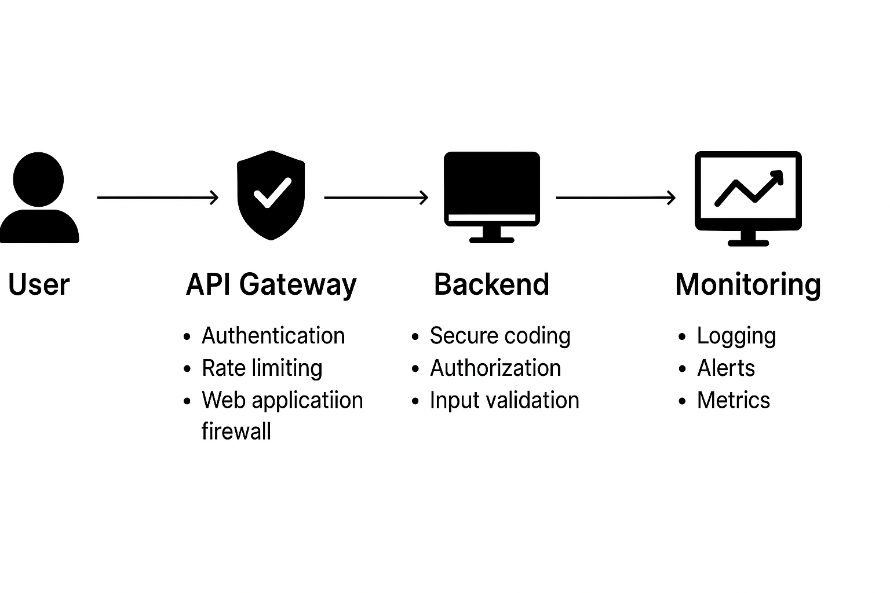

# 🏗 Job Board Platform – Secure System Design

## 1. High-Level Secure Architecture

```
        ┌───────────────┐
        │   Frontend    │   (React / Next.js / Mobile App)
        └───────┬───────┘
                │ HTTPS (TLS 1.2+)
        ┌───────▼────────┐
        │ API Gateway /  │   Rate limiting, WAF, auth checks
        │  Load Balancer │
        └───────┬────────┘
                │
        ┌───────▼────────┐
        │   Backend API  │   (Django + DRF)
        │   RBAC + JWT   │
        └───────┬────────┘
     ┌──────────┼──────────┐
     │          │           │
┌────▼───────┐  │   ┌──────▼──────┐
│ PostgreSQL │  │   │    Redis    │
│ Encrypted  │  │   │ Cache/Queue │
│ At Rest    │  │   │ Rate Limits │
└────┬───────┘  │   └──────┬──────┘
     │          │          │
┌────▼───────┐  │   ┌──────▼───────┐
│   Celery   │  │   │   Analytics  │
│ Worker Jobs│  │   │   (Optional) │
└────┬───────┘  │   └──────┬───────┘
     │          │          │
┌────▼───────┐  │   ┌──────▼───────┐
│ Payments   │  │   │ Request Logs │
│ Provider   │  │   │   (Secure)   │
└────────────┘  │   └──────────────┘
                │
          ┌─────▼─────┐
          │ Companies │
          │ Industries│
          └───────────┘
```

---

## 2. Security in Core Features

### User Management
- Passwords hashed with **Argon2** or bcrypt  
- JWT + refresh token flow with **short-lived access tokens**  
- Token blacklist/rotation on logout  
- Role-based access (Admin, Employer, Job Seeker)   

### Job Management
- Recruiters restricted to managing only their jobs  
- Admin moderation (`is_approved` flag)  
- Full audit logging of job changes  

### Applications
- Applicant PII encrypted at rest  
- Recruiters can only view applications for their postings  
- Status changes recorded in audit logs  

### Companies & Industries
- **Companies**: Ownership restricted to recruiter accounts  
- **Industries**: Admin-curated to prevent malicious input or spam categories  
- Validations ensure clean data models  

### Payments
- Integration with **secure payment provider (chapaa)** 
- No card data stored — only provider transaction IDs  
- Payment status (`pending`, `completed`, `failed`) tracked securely  
- Webhooks validated with provider signatures  
- Sensitive fields (amount, transaction_id) validated before processing  

### Analytics
- Metrics captured: job views, applications, recruiter engagement  
- Only **aggregate and anonymized data** stored (no raw PII in analytics)  
- Role-based access (admins see global metrics, recruiters only their data)  
- Data retention policy for compliance (GDPR/CCPA)  

### Rate Limiting
- Implemented at **API Gateway + Redis layer**  
- Configurable thresholds (per IP, per user, per endpoint)  
- Protects against brute force, scraping, DoS  
- Violations logged in `request_logs` for review  

### Request Logs
- Store metadata only: IP, timestamp, endpoint, status code  
- Sensitive payloads (passwords, tokens, PII) never logged  
- Logs used for **anomaly detection, forensics, and auditing**  
- Retention policy (e.g., 90 days) before rotation  

---

## 3. Secure Database Schema

- **Users**: hashed passwords, encrypted sensitive fields, login attempt tracking  
- **Jobs**: moderation flag, indexes for efficient lookups  
- **Applications**: minimal PII, encrypted fields, auditing  
- **Payments**: store only provider reference IDs, not raw card data  
- **Companies/Industries**: strong ownership rules + admin validation  
- **Request Logs**: anonymized IP, request metadata only  

---

## 4. Secure API Design

### Authentication
- `POST /auth/register` – Validates input, stores hashed password  
- `POST /auth/login` – Rate limited, issues JWT + refresh token  
- `POST /auth/refresh` – Rotates refresh token securely  

### Jobs
- `GET /jobs/` – Public (paginated, throttled)  
- `POST /jobs/` – Recruiter only  
- `PUT /jobs/{id}/` – Recruiter/Admin only  
- `DELETE /jobs/{id}/` – Admin only  

### Applications
- `POST /jobs/{id}/apply` – Job Seeker only  
- `GET /applications/` – User’s own applications only  
- `GET /recruiter/applications/` – Recruiter’s jobs only  

### Payments
- `POST /payments/checkout` – Initiates transaction with provider  
- `POST /payments/webhook` – Validates provider webhook signatures  
- `GET /payments/history` – User sees their own transactions only  

### Analytics
- `GET /analytics/overview` – Admin only  
- `GET /analytics/company/{id}` – Recruiter/company scoped only  

### Request Logs
- Accessible only to admins  
- Filterable by endpoint, IP, status, timestamp  

---

## 5. Scaling with Security

- **Database**: Indexed queries, partitioning for logs/analytics  
- **Caching**: Redis for rate limits + safe query caching  
- **Payments**: Provider offloads compliance (PCI DSS)  
- **Analytics**: Batch-processed to prevent high-load queries  
- **Request Logs**: Rotated and archived, searchable via ELK stack (optional)  

---

## 6. Security Layers Summary

| Layer            | Security Measure                                                   |
|------------------|--------------------------------------------------------------------|
| **Frontend**     | HTTPS only, secure cookies (HttpOnly, SameSite, Secure)            |
| **API Gateway**  | WAF, rate limiting, bot detection, IP allowlists for admin routes  |
| **Backend**      | JWT auth, RBAC checks, input validation                            |
| **Database**     | Encrypted at rest, least-privilege roles, query parameterization   |
| **Payments**     | Provider integration, webhook signature checks, no card storage    |
| **Analytics**    | Anonymized/aggregated data, role-restricted access                 |
| **Rate Limits**  | Redis-backed counters, per-IP and per-user thresholds              |
| **Companies**    | Recruiter-only ownership, admin validation                        |
| **Industries**   | Admin-managed list, sanitized inputs                               |
| **Request Logs** | Metadata only, no sensitive payloads, retention/rotation policy    |
| **Deployment**   | Secrets in env vars, CI/CD scans, Docker image hardening           |
| **Monitoring**   | Sentry, Prometheus/Grafana, alerts on anomalies                    |

---

## 7. Threat Modeling

- **Brute Force on Login** → Rate limiting + MFA  
- **SQL Injection** → ORM + parameterized queries  
- **XSS in Job Descriptions** → Input sanitization  
- **Payment Fraud** → Provider webhook verification + audit logs  
- **Data Leakage via Analytics** → Aggregation + anonymization  
- **Log Tampering** → Centralized, append-only log storage  
- **API Abuse** → Rate limiting + captcha/honeypots  

---

## 8. Incident Response & Vulnerability Disclosure

- Triage within **48 hours**, patch released before disclosure  
- Breach response: revoke tokens, rotate secrets, notify users  
- Payment issues: immediately notify provider + affected users  

---

## 9. Future Security Roadmap

- MFA for admins & recruiters  
- Automated dependency & container scans in CI/CD  
- Penetration testing & bug bounty program  
- Enhanced fraud detection for payments  
- Expanded analytics with stronger anonymization  
- Centralized log management (ELK, Loki)  


**Security Architecture diagram** (layers from user → API → DB with security at each step)
